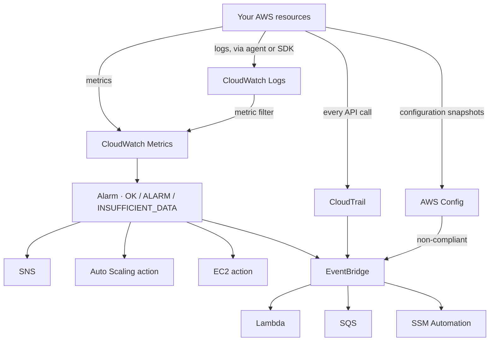

# Revision — 20 – Monitoring (CloudWatch, CloudTrail, Config, EventBridge)

> [!abstract] Night-before read · ~10 min · self-contained
> Everything you need is here — no need to jump back mid-revision.
> Full teaching explanations, Terraform and diagrams: **[[20-monitoring]]**
> Ends with a **self-test** — close the doc and answer it before you sleep.
> *Generated by `_scripts/build_revision.py` — do not edit.*
## The shape of it

> [!info] Exam TL;DR
> - **The whole topic collapses to one discrimination.** *"Is it healthy?"* → **CloudWatch**. *"Who did it?"* → **CloudTrail**. *"What is the configuration, and has it drifted?"* → **Config**. *"React automatically when X happens"* → **EventBridge**.
> - **EC2 basic monitoring is every 5 minutes. Detailed monitoring is every 1 minute** (and costs extra). Alarm periods must be ≥ the metric's resolution.
> - **Memory and disk-space are NOT default EC2 metrics.** They are *in-guest*, so they need the **CloudWatch agent**, and they arrive as **custom metrics** (billed as such).
> - **CloudTrail Event history is 90 days of management events only, free, per Region.** Anything longer, or data events, needs a **trail** delivering to S3.
> - **Data events are OFF by default** — *"trails and event data stores log management events, but not data or Insights events."* S3 object-level and Lambda invoke activity are data events.
> - **An alarm invokes actions only when it CHANGES state.** Three states: `OK`, `ALARM`, `INSUFFICIENT_DATA`.
> - **Composite alarms exist to reduce alarm noise** — and they cannot perform EC2 or Auto Scaling actions.
> - **EventBridge = CloudWatch Events, renamed.** Same service; a question naming either means the same thing.

## Architecture diagram

## Key facts, limits & pricing

*Verified against AWS docs 2026-09-25.*

- **Resolution:** *"Standard resolution, with data having a one-minute granularity"*; *"High resolution, with data at a granularity of one second."* AWS-service metrics are standard resolution by default.
- **Valid alarm/metric periods:** 1, 5, 10, 30, or **any multiple of 60** seconds. High-resolution alarms may use **10 or 30 seconds** and cost more.
- **EC2 monitoring:** *"basic monitoring for Amazon EC2 provides metrics for your instances every 5 minutes... Detailed monitoring... a resolution of 1 minute."* Alarm period must be ≥ the metric resolution.
- **Metric retention:** 3 hours / 15 days / 63 days / 455 days by period, as the table above. Metrics expire after **15 months** without new data.
- **Alarm history is kept 30 days.** There is **no limit** on the number of alarms.
- **CloudTrail Event history:** *"a viewable, searchable, downloadable, and immutable record of the past 90 days of CloudTrail management events in an AWS Region."*
- **Default trail contents:** *"By default, trails and event data stores log management events, but not data or Insights events."*
- **CloudTrail Insights** detects *"unusual API call rate or error rate activity... by analyzing CloudTrail management activity"* — measured against your own account's normal.
- **The CloudWatch agent** collects in-guest metrics and logs, publishes to the `CWAgent` namespace by default, and its metrics are **billed as custom metrics**.
- ⚠️ verify: the exact list of valid `retention_in_days` values for a log group (1 day → 10 years, plus "never expire" as the default) — confirm against the Logs docs before relying on a specific number.

## Comparisons

### The four services — the discrimination the exam actually tests
| Question in the stem | Service | What it records |
|---|---|---|
| "CPU is high", "alert when errors appear in the log", "how many invocations" | **CloudWatch** | metrics and logs — **behaviour** |
| "**Who** deleted it", "which user/role made this API call", "audit for compliance" | **CloudTrail** | API calls — **the caller** |
| "Was this bucket ever public", "are all volumes encrypted", "**configuration drift**", "compliance over time" | **Config** | resource **configuration** history + rules |
| "**Automatically** do X when Y happens", "run something on a schedule" | **EventBridge** | routes events to targets — **the reaction** |

### CloudTrail vs Config, on the same security group change
| | CloudTrail | Config |
|---|---|---|
| Tells you | **who** called `AuthorizeSecurityGroupIngress`, when, from where | **what the SG looked like** before and after, and whether that is compliant |
| Unit of record | an API call | a configuration item, versioned over time |
| Answers "was it ever open to 0.0.0.0/0 last month?" | no — only that a call happened | **yes** |
| Answers "which IAM principal did it?" | **yes** | no |
| Can enforce/remediate | no | **yes** — Config rules + SSM Automation remediation |

### CloudWatch event types
| | Metric alarm | Composite alarm | EventBridge rule |
|---|---|---|---|
| Watches | one metric or math expression | the **states of other alarms** | an event pattern or a schedule |
| Purpose | detect a threshold breach | **reduce alarm noise** | react to anything, route to many targets |
| Can trigger EC2 / Auto Scaling actions | **yes** | **no** | not directly |
| Can trigger SNS | yes | yes | yes |

### Management vs data events (CloudTrail)
| | Management events | Data events |
|---|---|---|
| Also called | control plane | **data plane** |
| Examples | `CreateTrail`, `AttachRolePolicy`, `RunInstances` | S3 `GetObject`/`PutObject`, Lambda `Invoke`, DynamoDB item ops |
| Logged by default | **yes** | **no** |
| Volume / cost | low | **high** — this is why they are opt-in |
| In the free 90-day Event history | yes | **no** |

### Getting an alert out of a log line
| Want | Use |
|---|---|
| Alarm when the app logs `ERROR` | **metric filter** on the log group → metric → alarm |
| Ad-hoc query across log groups | **CloudWatch Logs Insights** |
| Keep logs cheaply for years | **export to S3** (and lifecycle to Glacier) |
| Stream logs to a search/analytics tool | subscription filter → **Kinesis / Firehose / Lambda** |

## Worked examples

> [!example] Worked example — "alert us when the application starts erroring"
> The application writes to CloudWatch Logs via the agent. You cannot create an alarm on a log group directly — alarms watch **metrics**.
>
> So: a **metric filter** on the log group with a pattern like `ERROR`, whose `metric_transformation` publishes `1` to a custom metric each time a line matches. Then a **metric alarm** on that metric — say, ≥ 5 in 5 minutes — with an `alarm_action` pointing at an SNS topic.
>
> The chain is log line → metric filter → metric → alarm → SNS. When a stem says "notify the team when a specific string appears in the logs", the missing middle step is what it is testing.

> [!failure] Failure mode — the alarm that never fires, and the one that fires constantly
> Two opposite mistakes, both from period misuse.
>
> **Never fires:** you set a 1-minute alarm period on an EC2 instance with only basic monitoring, which publishes every **5** minutes. Four periods out of five have no data, so the alarm sits in `INSUFFICIENT_DATA` and the threshold is rarely evaluated. AWS's own guidance: *"select an alarm monitoring period that is greater than or equal to the metrics resolution."* Either enable detailed monitoring or use a 300-second period.
>
> **Fires constantly:** you alarm on a metric that a resource stops publishing when idle — an unattached EBS volume, a service with no traffic. The state flips to `INSUFFICIENT_DATA` and back. The fix is the alarm's **missing-data treatment**, not a different threshold.

## ⚠️ Traps — why the wrong answer looks right

> [!warning] Trap — CloudTrail for "what did this resource look like"
> CloudTrail records **the API call**, not the resulting state. "Was this bucket public at any point last quarter?" or "produce evidence that all volumes have been encrypted since January" is **AWS Config** — it stores configuration items over time and evaluates rules against them. CloudTrail can tell you `PutBucketAcl` was called; only Config tells you what the ACL then *was*.

> [!warning] Trap — memory utilisation in the EC2 console
> There is no default memory or disk-space metric for EC2, because the hypervisor cannot see inside the guest. Any stem that wants memory, swap, or free disk space needs the **CloudWatch agent**, and those arrive as **custom metrics**. Options offering "enable detailed monitoring" are the distractor — detailed monitoring changes the *frequency* (5 min → 1 min), never the *set* of metrics.

> [!warning] Trap — "enable CloudTrail to see who read the S3 object"
> CloudTrail is on by default only for **management events**. Object-level reads and writes are **data events**, which *"trails and event data stores"* do **not** log by default. The answer must include configuring data events (an event selector) on a trail — and note they are billed by volume, which is the reason they are opt-in.

> [!warning] Trap — CloudWatch Events versus EventBridge
> They are the same service; CloudWatch Events was renamed to EventBridge. If a question offers both as separate options, they are not testing a distinction — look at what else the options differ on. (Terraform still names the resources `aws_cloudwatch_event_rule` for the same historical reason.)

> [!warning] Trap — the 90 days
> "CloudTrail keeps 90 days" is true of the **free Event history view**, per Region, management events only. A **trail** delivering to S3 keeps events as long as you want, at S3 prices. A stem wanting "retain audit logs for seven years for compliance" is asking for a trail plus S3 lifecycle, not the console view.

> [!warning] Trap — composite alarms doing Auto Scaling
> Composite alarms exist to **reduce noise** by combining other alarms' states. They *"can send Amazon SNS notifications when they change state... but can't perform EC2 actions or Auto Scaling actions."* If the stem needs a scaling action, the alarm doing it must be a metric alarm.

## 🔴 My weak spots (this topic)   #weak-spot

*Not yet measured — I wrote this note from the video section, not from a drill. These are the places courses commonly teach a stale or half-fact, so check yourself against them first; real misses get added after the next mock.*

- [ ] **CloudWatch vs CloudTrail vs Config** — the one discrimination this whole topic reduces to. Behaviour / caller / configuration-over-time. Getting this reflexive is worth more than any individual limit.
- [ ] **Data events are off by default** — "enable CloudTrail" is never sufficient for S3 object-level or Lambda invoke activity.
- [ ] **Detailed monitoring changes frequency, not coverage** — 5 min → 1 min. It does not add memory or disk-space metrics; only the agent does.
- [ ] **Alarms fire on state CHANGE**, not continuously while breaching (Auto Scaling actions excepted).
- [ ] **You cannot alarm on a log line** — metric filter first, then alarm on the derived metric.

> [!tip] Production gap
> This note covers what the exam tests; production adds **X-Ray** (distributed tracing across the API-to-Lambda-to-DB hops), **Container Insights** and **Lambda Insights**, **CloudWatch Synthetics** canaries for outside-in checks, **Contributor Insights** for top-N analysis, log **subscription filters** to a SIEM, and an **organization trail** so member accounts cannot disable their own auditing. Config gains **conformance packs** and auto-remediation via SSM Automation.

## Self-test

> [!question] Close the doc first.
> Reading a comparison and being able to *produce* it are different skills, and
> only the second one survives a question written to make two answers look alike.
> Say each answer out loud before you unfold it — if you can only recognise it,
> you do not know it yet.

### You have got these wrong before

*Your own recorded misses. Answer each one before unfolding it — these are, by definition, the ones that have already cost you marks.*

> [!question]- CloudWatch vs CloudTrail vs Config
> the one discrimination this whole topic reduces to. Behaviour / caller / configuration-over-time. Getting this reflexive is worth more than any individual limit.

> [!question]- Data events are off by default
> "enable CloudTrail" is never sufficient for S3 object-level or Lambda invoke activity.

> [!question]- Detailed monitoring changes frequency, not coverage
> 5 min → 1 min. It does not add memory or disk-space metrics; only the agent does.

> [!question]- Alarms fire on state CHANGE
> , not continuously while breaching (Auto Scaling actions excepted).

> [!question]- You cannot alarm on a log line
> metric filter first, then alarm on the derived metric.

**1. The four services — the discrimination the exam actually tests** — fill the blank cells from memory.

| Question in the stem | Service | What it records |
|---|---|---|
| "CPU is high", "alert when errors appear in the log", "how many invocations" |   |   |
| "**Who** deleted it", "which user/role made this API call", "audit for compliance" |   |   |
| "Was this bucket ever public", "are all volumes encrypted", "**configuration drift**", "compliance over time" |   |   |
| "**Automatically** do X when Y happens", "run something on a schedule" |   |   |

> [!success]- Answer
> | Question in the stem | Service | What it records |
> |---|---|---|
> | "CPU is high", "alert when errors appear in the log", "how many invocations" | **CloudWatch** | metrics and logs — **behaviour** |
> | "**Who** deleted it", "which user/role made this API call", "audit for compliance" | **CloudTrail** | API calls — **the caller** |
> | "Was this bucket ever public", "are all volumes encrypted", "**configuration drift**", "compliance over time" | **Config** | resource **configuration** history + rules |
> | "**Automatically** do X when Y happens", "run something on a schedule" | **EventBridge** | routes events to targets — **the reaction** |

**2. CloudTrail vs Config, on the same security group change** — fill the blank cells from memory.

| | CloudTrail | Config |
|---|---|---|
| Tells you |   |   |
| Unit of record |   |   |
| Answers "was it ever open to 0.0.0.0/0 last month?" |   |   |
| Answers "which IAM principal did it?" |   |   |
| Can enforce/remediate |   |   |

> [!success]- Answer
> | | CloudTrail | Config |
> |---|---|---|
> | Tells you | **who** called `AuthorizeSecurityGroupIngress`, when, from where | **what the SG looked like** before and after, and whether that is compliant |
> | Unit of record | an API call | a configuration item, versioned over time |
> | Answers "was it ever open to 0.0.0.0/0 last month?" | no — only that a call happened | **yes** |
> | Answers "which IAM principal did it?" | **yes** | no |
> | Can enforce/remediate | no | **yes** — Config rules + SSM Automation remediation |

**3. CloudWatch event types** — fill the blank cells from memory.

| | Metric alarm | Composite alarm | EventBridge rule |
|---|---|---|---|
| Watches |   |   |   |
| Purpose |   |   |   |
| Can trigger EC2 / Auto Scaling actions |   |   |   |
| Can trigger SNS |   |   |   |

> [!success]- Answer
> | | Metric alarm | Composite alarm | EventBridge rule |
> |---|---|---|---|
> | Watches | one metric or math expression | the **states of other alarms** | an event pattern or a schedule |
> | Purpose | detect a threshold breach | **reduce alarm noise** | react to anything, route to many targets |
> | Can trigger EC2 / Auto Scaling actions | **yes** | **no** | not directly |
> | Can trigger SNS | yes | yes | yes |

**4. Management vs data events (CloudTrail)** — fill the blank cells from memory.

| | Management events | Data events |
|---|---|---|
| Also called |   |   |
| Examples |   |   |
| Logged by default |   |   |
| Volume / cost |   |   |
| In the free 90-day Event history |   |   |

> [!success]- Answer
> | | Management events | Data events |
> |---|---|---|
> | Also called | control plane | **data plane** |
> | Examples | `CreateTrail`, `AttachRolePolicy`, `RunInstances` | S3 `GetObject`/`PutObject`, Lambda `Invoke`, DynamoDB item ops |
> | Logged by default | **yes** | **no** |
> | Volume / cost | low | **high** — this is why they are opt-in |
> | In the free 90-day Event history | yes | **no** |

### The traps

*Each of these is a place a plausible-looking answer is wrong. Say why before unfolding.*

> [!question]- CloudTrail for "what did this resource look like"
> CloudTrail records **the API call**, not the resulting state. "Was this bucket public at any point last quarter?" or "produce evidence that all volumes have been encrypted since January" is **AWS Config** — it stores configuration items over time and evaluates rules against them. CloudTrail can tell you `PutBucketAcl` was called; only Config tells you what the ACL then *was*.

> [!question]- memory utilisation in the EC2 console
> There is no default memory or disk-space metric for EC2, because the hypervisor cannot see inside the guest. Any stem that wants memory, swap, or free disk space needs the **CloudWatch agent**, and those arrive as **custom metrics**. Options offering "enable detailed monitoring" are the distractor — detailed monitoring changes the *frequency* (5 min → 1 min), never the *set* of metrics.

> [!question]- "enable CloudTrail to see who read the S3 object"
> CloudTrail is on by default only for **management events**. Object-level reads and writes are **data events**, which *"trails and event data stores"* do **not** log by default. The answer must include configuring data events (an event selector) on a trail — and note they are billed by volume, which is the reason they are opt-in.

> [!question]- CloudWatch Events versus EventBridge
> They are the same service; CloudWatch Events was renamed to EventBridge. If a question offers both as separate options, they are not testing a distinction — look at what else the options differ on. (Terraform still names the resources `aws_cloudwatch_event_rule` for the same historical reason.)

> [!question]- the 90 days
> "CloudTrail keeps 90 days" is true of the **free Event history view**, per Region, management events only. A **trail** delivering to S3 keeps events as long as you want, at S3 prices. A stem wanting "retain audit logs for seven years for compliance" is asking for a trail plus S3 lifecycle, not the console view.

> [!question]- composite alarms doing Auto Scaling
> Composite alarms exist to **reduce noise** by combining other alarms' states. They *"can send Amazon SNS notifications when they change state... but can't perform EC2 actions or Auto Scaling actions."* If the stem needs a scaling action, the alarm doing it must be a metric alarm.

*Answers are lifted verbatim from [[20-monitoring]]. Generated by `_scripts/build_revision.py` — do not edit.*
