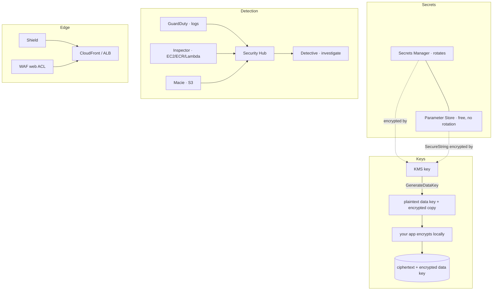

# Revision — 21 – Security & Encryption

> [!abstract] Night-before read · ~11 min · self-contained
> Everything you need is here — no need to jump back mid-revision.
> Full teaching explanations, Terraform and diagrams: **[[21-security]]**
> Ends with a **self-test** — close the doc and answer it before you sleep.
> *Generated by `_scripts/build_revision.py` — do not edit.*
## The shape of it

> [!info] Exam TL;DR
> - **KMS encrypts up to 4,096 bytes directly.** Anything bigger uses **envelope encryption**: `GenerateDataKey` returns a plaintext data key *and* an encrypted copy; you encrypt the data locally and store the encrypted key beside it.
> - **Automatic rotation is yearly by default and now configurable** (`RotationPeriodInDays`, default **365**). **AWS managed keys rotate every year** — that changed from three years in May 2022, so older courses say 1,095 days.
> - **Rotation does not re-encrypt your data**, does not rotate data keys, and does not change the key ID. Old key material is retained so old ciphertext still decrypts.
> - **Only symmetric KMS-generated keys auto-rotate.** Asymmetric, HMAC and custom-key-store keys must be rotated **manually**.
> - **Secrets Manager rotates; Parameter Store does not.** Parameter Store Standard is **free, 4 KB, 10,000 params**; Advanced is **paid, 8 KB, 100,000, supports policies** — and you can upgrade but **never downgrade**.
> - **Detection services, one line each:** GuardDuty = threats from **logs**; Inspector = **vulnerabilities** in EC2/ECR/Lambda; Macie = **sensitive data in S3**; Security Hub = **aggregates** everyone's findings; Detective = **investigate** a finding's root cause.
> - **Shield Standard is free and automatic (L3/L4). Shield Advanced is $3,000/month with a 1-year commitment.**
> - **WAF attaches to ALB, API Gateway REST, AppSync, Cognito user pool, App Runner, Amplify, Verified Access — and CloudFront. Never to an NLB or an EC2 instance.**

## Architecture diagram

## Key facts, limits & pricing

*Verified against AWS docs 2026-09-25.*

- **KMS `Encrypt` maximum plaintext: 4,096 bytes** for `SYMMETRIC_DEFAULT`. (Asymmetric is smaller still — RSA_2048 with OAEP-SHA-256 is 190 bytes.)
- **Rotation period:** *"If you do not specify a value for `RotationPeriodInDays`... the default value is 365 days."* **On-demand rotation: maximum 25 per key, and this quota is not adjustable.**
- **AWS managed keys:** *"AWS KMS automatically rotates AWS managed keys every year"* — and *"In May 2022, AWS KMS changed the rotation schedule for AWS managed keys from every three years (approximately 1,095 days) to every year."*
- **Cannot auto-rotate:** asymmetric KMS keys, HMAC KMS keys, keys in custom key stores — these are rotated **manually**.
- **KMS quotas:** 100,000 customer managed keys per Region, **50 aliases per key**, **50,000 grants per key**, 10 custom key stores.
- **Parameter Store tiers:** Standard — **10,000** parameters, **4 KB**, no policies, no cross-account sharing, **no charge**. Advanced — **100,000**, **8 KB**, policies **supported**, shareable, **charges apply**. *"You can change a standard parameter to an advanced parameter, but you can't change an advanced parameter to a standard parameter."*
- **GuardDuty foundational data sources:** **CloudTrail management events, VPC Flow Logs, Route 53 Resolver DNS query logs** — consumed as independent duplicate streams, so *"You don't need to enable anything else"* and your own flow-log config is unaffected. 30-day free trial.
- **Inspector** scans **EC2 instances, container images in ECR, and Lambda functions**, *"continually"* and automatically — *"you don't need to manually schedule or configure assessment scans"* — rescanning when a package changes or a new CVE is published.
- **Macie** analyses **Amazon S3** — bucket inventory, public-access posture, and sensitive-data discovery using **managed** and **custom data identifiers**. 30-day free trial.
- **Shield Standard:** protection *"for all AWS customers... at no additional charge"* (network/transport layer). **Shield Advanced: $3,000/month, 1-year commitment**, and it covers standard WAF costs on protected resources.
- **WAF web ACL targets:** regional — **API Gateway REST API, Application Load Balancer, AppSync GraphQL API, Cognito user pool, App Runner, Verified Access, Amplify**; global — **CloudFront**, whose web ACL *"will have a hard-coded Region of US East (N. Virginia)"*. One web ACL per resource; a CloudFront web ACL cannot also be attached to a regional resource.

## Comparisons

### KMS key types
| | Customer managed | AWS managed (`aws/service`) | AWS owned |
|---|---|---|---|
| Who creates it | **you** | AWS, on first use of a service | AWS, internally |
| Key policy you control | **yes** | **no** | no — invisible to you |
| Rotation | optional; default **365 days**, configurable, plus on-demand | **every year**, not controllable | the service decides |
| Cost | ~$1/month + requests | **free** | free |
| Visible in your account | yes | yes | **no** |
| Choose this when | cross-account, custom policy, audit, compliance, BYOK | you just want encryption on | never — you don't choose it |

### Secrets Manager vs SSM Parameter Store
| | Secrets Manager | Parameter Store |
|---|---|---|
| Automatic rotation | **yes** (Lambda, or **managed** rotation for RDS/Aurora master users) | **no** |
| Cost | **per secret per month** + API calls | Standard **free**; Advanced paid |
| Max value size | 64 KB | **4 KB** standard / **8 KB** advanced |
| Cross-account access | via resource policy | Advanced tier only |
| KMS encryption | always | only for `SecureString` |
| Exam trigger | "**rotate** the database password automatically" | "store configuration/licence keys cheaply", "hierarchy of parameters" |

### Which detection service
| The stem says | Service | Because its input is |
|---|---|---|
| "unusual API calls", "crypto-mining", "compromised instance calling a known bad IP" | **GuardDuty** | CloudTrail + VPC Flow Logs + DNS logs |
| "unpatched software", "CVE", "vulnerability scan of our EC2/containers" | **Inspector** | the software on EC2, ECR images, Lambda |
| "PII", "credit card numbers", "is there sensitive data in our buckets" | **Macie** | **S3 objects only** |
| "single pane of glass", "aggregate findings", "CIS benchmark compliance" | **Security Hub** | other services' findings |
| "investigate the root cause of this finding", "visualise the relationships" | **Detective** | the same logs, as a behaviour graph |
| "central firewall rules across all accounts in the org" | **Firewall Manager** | WAF/Shield/SG policies, org-wide |

### Shield Standard vs Advanced vs WAF
| | Shield Standard | Shield Advanced | WAF |
|---|---|---|---|
| Protects against | L3/L4 DDoS | L3/L4/L7 DDoS | **L7 application** attacks (SQLi, XSS, bots) |
| Cost | **free, automatic** | **$3,000/mo, 1-year commitment** | per web ACL + per rule + per request |
| Extras | — | 24×7 SRT access, **DDoS cost protection**, covers WAF cost on protected resources | rate-based rules, managed rule groups, CAPTCHA |
| You configure rules | no | no | **yes** |

### CloudHSM vs KMS
| | KMS | CloudHSM |
|---|---|---|
| Tenancy | multi-tenant, AWS-managed | **dedicated single-tenant HSM** |
| Who holds the keys | AWS (FIPS 140-3 validated) | **you** — AWS cannot access them |
| Key control | key policies, IAM | you manage users and keys in the HSM |
| Supports | symmetric, asymmetric, HMAC | full suite incl. **SSL offload, custom crypto** |
| Exam trigger | almost everything | "**we must control the keys**", "FIPS 140-3 **Level 3**", regulatory requirement for dedicated hardware |

## Worked examples

> [!example] Worked example — encrypting a 500 MB object with a 4 KB limit
> You cannot call `Encrypt` on a 500 MB file; the limit is 4,096 bytes. What actually happens — and what S3 SSE-KMS does on your behalf — is **envelope encryption**:
>
> 1. Call **`GenerateDataKey`** against your KMS key. It returns a **plaintext data key** and an **encrypted copy** of that same key.
> 2. Encrypt the 500 MB locally with the plaintext key (fast, local, no network).
> 3. **Discard the plaintext key** from memory. Store the **encrypted** data key next to the ciphertext.
> 4. To read: send the encrypted data key to **`Decrypt`**, get the plaintext key back, decrypt locally.
>
> KMS never sees the 500 MB, only the 32-byte key. This is also why key rotation doesn't re-encrypt anything — your objects are encrypted with *data keys*, and rotation changes the key material that wraps them, not the data keys themselves.

> [!failure] Failure mode — the cross-account restore that cannot decrypt
> A team encrypts RDS snapshots with the default `aws/rds` **AWS managed key**, then tries to share a snapshot with another account. It fails, and no amount of IAM policy fixes it: you cannot modify the key policy of an AWS managed key, and a snapshot encrypted under one cannot be shared cross-account at all.
>
> The fix is structural, not permissions: use a **customer managed key**, add the other account as a principal in the **key policy**, re-encrypt the snapshot by copying it with the CMK, then share. The same shape appears with encrypted AMIs and EBS snapshots. Any stem combining "encrypted" with "another account" is pointing at a customer managed key.

## ⚠️ Traps — why the wrong answer looks right

> [!warning] Trap — rotation re-encrypts your data
> It does not. *"Key rotation has no effect on the data that the KMS key protects. It does not rotate the data keys that the KMS key generated or re-encrypt any data protected by the KMS key."* Old key material is retained so old ciphertext still decrypts, and the **key ID is unchanged** — which is why rotation is transparent to applications and requires no code change.

> [!warning] Trap — "rotate this asymmetric key automatically"
> Automatic rotation is *"supported only on symmetric encryption KMS keys with key material that AWS KMS generates."* **Asymmetric keys, HMAC keys and custom-key-store keys cannot auto-rotate** — the answer is manual rotation (create a new key, repoint the alias).

> [!warning] Trap — Parameter Store for a rotating password
> Parameter Store has **no rotation**. `SecureString` encrypts a value with KMS; it does not change it on a schedule. "Automatically rotate the credential every 30 days" is **Secrets Manager**, every time. The reverse trap also appears: if the stem stresses *cost* for thousands of plain config values, Secrets Manager's per-secret fee makes Parameter Store the answer.

> [!warning] Trap — Macie on anything other than S3
> Macie is *"a data security service that discovers sensitive data"* in **Amazon S3**. It does not scan RDS, EBS, DynamoDB or EFS. If the data in the stem isn't in S3, Macie is the distractor.

> [!warning] Trap — WAF on a Network Load Balancer
> A web ACL attaches to an **ALB**, API Gateway REST API, AppSync, Cognito user pool, App Runner, Amplify, Verified Access — or **CloudFront**. **Not an NLB, not an EC2 instance directly.** WAF inspects HTTP(S), and an NLB operates at layer 4 where there is no HTTP to inspect. If the architecture in the stem has an NLB and the requirement is L7 filtering, something else in the answer must change.

> [!warning] Trap — Shield Advanced to block SQL injection
> Shield is **DDoS**. SQL injection, XSS and bad bots are **WAF**. Shield Advanced adds layer-7 DDoS mitigation and *covers* your standard WAF costs on protected resources, but it is not where you write "block requests containing `' OR 1=1`". Rules are a WAF concept.

> [!warning] Trap — GuardDuty needs you to turn on flow logs
> It does not. GuardDuty consumes *"an independent and duplicated stream"* of CloudTrail management events, VPC Flow Logs and Route 53 DNS query logs — *"You don't need to enable anything else"*, and enabling or disabling your own flow logs changes nothing about GuardDuty. Options telling you to configure the data sources first are the distractor.

## 🔴 My weak spots (this topic)   #weak-spot

*Not yet measured — written from the video section rather than a drill. These are where courses commonly teach a stale or half-fact, so check yourself against them first; real misses get added after the next mock.*

- [ ] **AWS managed key rotation is yearly, not three-yearly** — AWS changed it in May 2022 and a lot of material still says 1,095 days.
- [ ] **KMS rotation period is configurable now**, and **on-demand rotation exists** (max 25 per key). "Exactly once a year, fixed" is the old answer.
- [ ] **The 4 KB limit is the reason for envelope encryption**, not a quota to recite. Be able to say what `GenerateDataKey` returns and why there are two versions of the key.
- [ ] **Which detection service by INPUT** — GuardDuty reads logs, Inspector reads software, Macie reads S3 objects. Naming the input picks the service faster than recalling a description.
- [ ] **Secrets Manager rotates, Parameter Store does not.** SecureString is encryption, not rotation.
- [ ] **WAF cannot attach to an NLB** — no HTTP at layer 4 to inspect.

> [!tip] Production gap
> This note is exam-shaped. Production adds **Firewall Manager** to push WAF and security-group policies across an Organization, **Security Hub** standards (CIS, AWS Foundational) with automated remediation, KMS **multi-Region keys** for cross-Region DR of encrypted data, **grants** rather than broad key policies for short-lived service access, **key policy** conditions like `kms:ViaService` to restrict a key to one service, ACM **Private CA** for internal TLS, and CloudHSM where a regulator requires single-tenant hardware.

## Self-test

> [!question] Close the doc first.
> Reading a comparison and being able to *produce* it are different skills, and
> only the second one survives a question written to make two answers look alike.
> Say each answer out loud before you unfold it — if you can only recognise it,
> you do not know it yet.

### You have got these wrong before

*Your own recorded misses. Answer each one before unfolding it — these are, by definition, the ones that have already cost you marks.*

> [!question]- AWS managed key rotation is yearly, not three-yearly
> AWS changed it in May 2022 and a lot of material still says 1,095 days.

> [!question]- KMS rotation period is configurable now
> , and **on-demand rotation exists** (max 25 per key). "Exactly once a year, fixed" is the old answer.

> [!question]- The 4 KB limit is the reason for envelope encryption
> , not a quota to recite. Be able to say what `GenerateDataKey` returns and why there are two versions of the key.

> [!question]- Which detection service by INPUT
> GuardDuty reads logs, Inspector reads software, Macie reads S3 objects. Naming the input picks the service faster than recalling a description.

> [!question]- Secrets Manager rotates, Parameter Store does not.
> SecureString is encryption, not rotation.

> [!question]- WAF cannot attach to an NLB
> no HTTP at layer 4 to inspect.

**1. KMS key types** — fill the blank cells from memory.

| | Customer managed | AWS managed (`aws/service`) | AWS owned |
|---|---|---|---|
| Who creates it |   |   |   |
| Key policy you control |   |   |   |
| Rotation |   |   |   |
| Cost |   |   |   |
| Visible in your account |   |   |   |
| Choose this when |   |   |   |

> [!success]- Answer
> | | Customer managed | AWS managed (`aws/service`) | AWS owned |
> |---|---|---|---|
> | Who creates it | **you** | AWS, on first use of a service | AWS, internally |
> | Key policy you control | **yes** | **no** | no — invisible to you |
> | Rotation | optional; default **365 days**, configurable, plus on-demand | **every year**, not controllable | the service decides |
> | Cost | ~$1/month + requests | **free** | free |
> | Visible in your account | yes | yes | **no** |
> | Choose this when | cross-account, custom policy, audit, compliance, BYOK | you just want encryption on | never — you don't choose it |

**2. Secrets Manager vs SSM Parameter Store** — fill the blank cells from memory.

| | Secrets Manager | Parameter Store |
|---|---|---|
| Automatic rotation |   |   |
| Cost |   |   |
| Max value size |   |   |
| Cross-account access |   |   |
| KMS encryption |   |   |
| Exam trigger |   |   |

> [!success]- Answer
> | | Secrets Manager | Parameter Store |
> |---|---|---|
> | Automatic rotation | **yes** (Lambda, or **managed** rotation for RDS/Aurora master users) | **no** |
> | Cost | **per secret per month** + API calls | Standard **free**; Advanced paid |
> | Max value size | 64 KB | **4 KB** standard / **8 KB** advanced |
> | Cross-account access | via resource policy | Advanced tier only |
> | KMS encryption | always | only for `SecureString` |
> | Exam trigger | "**rotate** the database password automatically" | "store configuration/licence keys cheaply", "hierarchy of parameters" |

**3. Which detection service** — fill the blank cells from memory.

| The stem says | Service | Because its input is |
|---|---|---|
| "unusual API calls", "crypto-mining", "compromised instance calling a known bad IP" |   |   |
| "unpatched software", "CVE", "vulnerability scan of our EC2/containers" |   |   |
| "PII", "credit card numbers", "is there sensitive data in our buckets" |   |   |
| "single pane of glass", "aggregate findings", "CIS benchmark compliance" |   |   |
| "investigate the root cause of this finding", "visualise the relationships" |   |   |
| "central firewall rules across all accounts in the org" |   |   |

> [!success]- Answer
> | The stem says | Service | Because its input is |
> |---|---|---|
> | "unusual API calls", "crypto-mining", "compromised instance calling a known bad IP" | **GuardDuty** | CloudTrail + VPC Flow Logs + DNS logs |
> | "unpatched software", "CVE", "vulnerability scan of our EC2/containers" | **Inspector** | the software on EC2, ECR images, Lambda |
> | "PII", "credit card numbers", "is there sensitive data in our buckets" | **Macie** | **S3 objects only** |
> | "single pane of glass", "aggregate findings", "CIS benchmark compliance" | **Security Hub** | other services' findings |
> | "investigate the root cause of this finding", "visualise the relationships" | **Detective** | the same logs, as a behaviour graph |
> | "central firewall rules across all accounts in the org" | **Firewall Manager** | WAF/Shield/SG policies, org-wide |

**4. Shield Standard vs Advanced vs WAF** — fill the blank cells from memory.

| | Shield Standard | Shield Advanced | WAF |
|---|---|---|---|
| Protects against |   |   |   |
| Cost |   |   |   |
| Extras |   |   |   |
| You configure rules |   |   |   |

> [!success]- Answer
> | | Shield Standard | Shield Advanced | WAF |
> |---|---|---|---|
> | Protects against | L3/L4 DDoS | L3/L4/L7 DDoS | **L7 application** attacks (SQLi, XSS, bots) |
> | Cost | **free, automatic** | **$3,000/mo, 1-year commitment** | per web ACL + per rule + per request |
> | Extras | — | 24×7 SRT access, **DDoS cost protection**, covers WAF cost on protected resources | rate-based rules, managed rule groups, CAPTCHA |
> | You configure rules | no | no | **yes** |

**5. CloudHSM vs KMS** — fill the blank cells from memory.

| | KMS | CloudHSM |
|---|---|---|
| Tenancy |   |   |
| Who holds the keys |   |   |
| Key control |   |   |
| Supports |   |   |
| Exam trigger |   |   |

> [!success]- Answer
> | | KMS | CloudHSM |
> |---|---|---|
> | Tenancy | multi-tenant, AWS-managed | **dedicated single-tenant HSM** |
> | Who holds the keys | AWS (FIPS 140-3 validated) | **you** — AWS cannot access them |
> | Key control | key policies, IAM | you manage users and keys in the HSM |
> | Supports | symmetric, asymmetric, HMAC | full suite incl. **SSL offload, custom crypto** |
> | Exam trigger | almost everything | "**we must control the keys**", "FIPS 140-3 **Level 3**", regulatory requirement for dedicated hardware |

### The traps

*Each of these is a place a plausible-looking answer is wrong. Say why before unfolding.*

> [!question]- rotation re-encrypts your data
> It does not. *"Key rotation has no effect on the data that the KMS key protects. It does not rotate the data keys that the KMS key generated or re-encrypt any data protected by the KMS key."* Old key material is retained so old ciphertext still decrypts, and the **key ID is unchanged** — which is why rotation is transparent to applications and requires no code change.

> [!question]- "rotate this asymmetric key automatically"
> Automatic rotation is *"supported only on symmetric encryption KMS keys with key material that AWS KMS generates."* **Asymmetric keys, HMAC keys and custom-key-store keys cannot auto-rotate** — the answer is manual rotation (create a new key, repoint the alias).

> [!question]- Parameter Store for a rotating password
> Parameter Store has **no rotation**. `SecureString` encrypts a value with KMS; it does not change it on a schedule. "Automatically rotate the credential every 30 days" is **Secrets Manager**, every time. The reverse trap also appears: if the stem stresses *cost* for thousands of plain config values, Secrets Manager's per-secret fee makes Parameter Store the answer.

> [!question]- Macie on anything other than S3
> Macie is *"a data security service that discovers sensitive data"* in **Amazon S3**. It does not scan RDS, EBS, DynamoDB or EFS. If the data in the stem isn't in S3, Macie is the distractor.

> [!question]- WAF on a Network Load Balancer
> A web ACL attaches to an **ALB**, API Gateway REST API, AppSync, Cognito user pool, App Runner, Amplify, Verified Access — or **CloudFront**. **Not an NLB, not an EC2 instance directly.** WAF inspects HTTP(S), and an NLB operates at layer 4 where there is no HTTP to inspect. If the architecture in the stem has an NLB and the requirement is L7 filtering, something else in the answer must change.

> [!question]- Shield Advanced to block SQL injection
> Shield is **DDoS**. SQL injection, XSS and bad bots are **WAF**. Shield Advanced adds layer-7 DDoS mitigation and *covers* your standard WAF costs on protected resources, but it is not where you write "block requests containing `' OR 1=1`". Rules are a WAF concept.

> [!question]- GuardDuty needs you to turn on flow logs
> It does not. GuardDuty consumes *"an independent and duplicated stream"* of CloudTrail management events, VPC Flow Logs and Route 53 DNS query logs — *"You don't need to enable anything else"*, and enabling or disabling your own flow logs changes nothing about GuardDuty. Options telling you to configure the data sources first are the distractor.

*Answers are lifted verbatim from [[21-security]]. Generated by `_scripts/build_revision.py` — do not edit.*
