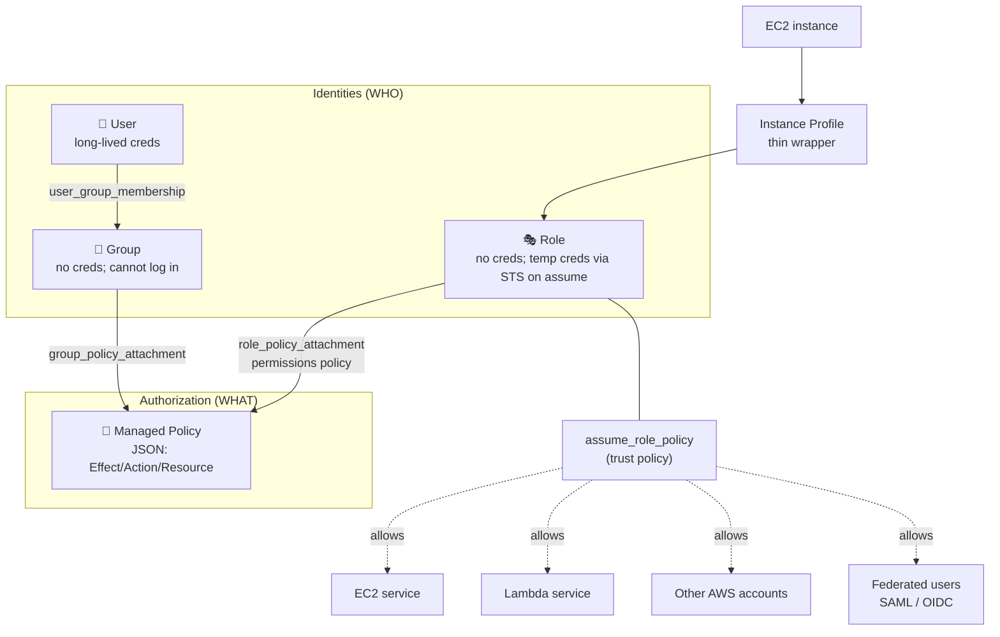

# 01 – IAM (Identity and Access Management)

The global, free AWS service that authenticates and authorizes every AWS API call — every console click, every CLI command, every SDK request gets evaluated against IAM before it reaches the underlying service.

## 🎯 Exam TL;DR

- **IAM is global, free, and always-on.** No region selection. Same identities and policies seen from every region.
- **Four core objects:** User, Group, Role, Policy. Groups can't log in; only Users can.
- **Explicit Deny always wins.** Evaluation: implicit deny (default) → explicit Allow lifts it → explicit Deny overrides everything. One Deny anywhere in any attached policy = no access. Order, count, and specificity all don't matter.
- **Users have long-lived credentials** (password, access key). **Roles have none** — on assume, AWS STS issues temporary credentials (default 1h, max 12h). Prefer Roles + federation for both humans and services.
- **Roles use two distinct policies:** *trust policy* (`assume_role_policy` — WHO can assume) + *permissions policy* (attached separately — WHAT can be done once assumed). Either half missing = role doesn't work.
- **EC2 doesn't attach to a role directly** — it attaches to an *Instance Profile*, a thin wrapper around a role. Console hides this; Terraform makes it explicit. (Lambda, ECS, etc. take roles directly.)

## Concept (plain English)

Without IAM, anyone with the AWS account credentials would have full god-level access — no separation of duties, no audit trail, no safe way for services to talk to each other. IAM solves authentication ("who are you?") and authorization ("what are you allowed to do?") for every AWS API call. Identities prove WHO; policies declare WHAT. IAM is global, free, and always-on; it costs nothing to use and there is no opt-in.

## AWS console ↔ Terraform map

| Console / what you want | Terraform resource | Notes |
|---|---|---|
| Create an IAM user | `aws_iam_user` | Console password is separate (`aws_iam_user_login_profile`); access keys are separate (`aws_iam_access_key`). |
| Create an IAM group | `aws_iam_group` | IAM Groups do **not** support tags (AWS-side limitation). |
| Put a user in a group | `aws_iam_user_group_membership` | Additive (user-side). **NOT** `aws_iam_group_membership`, which is exclusive group-side. |
| Create a customer-managed policy | `aws_iam_policy` | `policy` argument takes JSON. Build with `data "aws_iam_policy_document"` for native HCL + plan-time validation. |
| Attach a managed policy to a user/group/role | `aws_iam_user_policy_attachment` / `aws_iam_group_policy_attachment` / `aws_iam_role_policy_attachment` | One resource per (principal, policy) pair. **Avoid** the prefix-less `aws_iam_policy_attachment` — see Traps. |
| Inline policy on a principal | `aws_iam_user_policy` / `aws_iam_group_policy` / `aws_iam_role_policy` | Lives and dies with the principal; not reusable. Prefer managed for reusability. |
| Exclusively manage all policies on one principal | `aws_iam_user_policy_attachments_exclusive` / `aws_iam_group_policy_attachments_exclusive` / `aws_iam_role_policy_attachments_exclusive` | The safe modern way to say "Terraform owns all attachments on this principal." |
| Create a role | `aws_iam_role` | `assume_role_policy` argument = **trust policy**, NOT permissions. |
| Attach the role to an EC2 instance | `aws_iam_instance_profile` + reference from `aws_instance.iam_instance_profile` | EC2 takes an instance profile, not a role directly. Lambda/ECS take roles directly. |
| Reference an existing AWS-managed policy | `data "aws_iam_policy"` data source | Or hardcode the ARN (`arn:aws:iam::aws:policy/AmazonS3ReadOnlyAccess` — stable). |
| Build policy JSON natively in HCL | `data "aws_iam_policy_document"` | Validated at plan time; supports interpolation/loops; the idiomatic pattern. |

## Architecture diagram

## Key facts, limits & pricing

- **Global service** — no region picker. Same IAM seen from every region. (The IAM API endpoint historically lives in `us-east-1` infrastructure, but the concept and the data are global.)
- **Free** — no per-user, per-policy, or per-API-call charge. STS calls are free too. Only some advanced features (IAM Identity Center premium features, IAM Access Analyzer findings) have separate pricing.
- **Eventually consistent** — newly created users/roles/policies may take a few seconds to become globally visible. A `terraform apply` that creates a role and immediately tries to use it can race; usually a retry resolves it. Worth knowing for real-world AND exam scenarios.
- **Principal identification is by name; policy identification is by ARN.** Reason: principals only exist within your account (name is unambiguous in that scope); policies may live in the `aws` account namespace (AWS-managed, e.g. `arn:aws:iam::aws:policy/AmazonS3ReadOnlyAccess`) or your account namespace, so the full ARN with account ID is needed for disambiguation.
- **Inline vs managed policies:**
  - *Managed* — standalone, reusable, versioned (up to 5 versions retained, can roll back), attachable to many principals.
  - *Inline* — embedded directly on one principal; deleted when the principal is deleted; not reusable; no versioning.
- **`aws_iam_user.name` is in-place updatable** in the v6 provider (uses AWS `UpdateUser` API). **`aws_iam_policy.name` is NOT** — it has `ForceNew: true`, so renaming a policy destroys and recreates it (the policy ARN embeds the name, so AWS can't rename in place). **Lesson:** behavior is NOT consistent across the IAM resource family; read the plan.
- **Service quotas** (max users per account, max policies per principal, policy size limits, etc.) change over time. ⚠️ Don't memorize specific numbers — refer to the AWS service quotas page (linked in Docs).

## Comparisons

### User vs Role

|   | User | Role |
|---|---|---|
| Credentials | Long-lived (password and/or access key + secret) | None of its own; temporary credentials via STS on assume (default 1h, configurable to 12h) |
| "Owned" by | A specific identity (usually a human) | Nobody — a hat anyone allowed can wear |
| When to use | A specific human (legacy), a specific service account (legacy) | AWS services accessing other AWS services; cross-account access; federated humans; temporary privilege elevation |
| Modern best practice | **Avoid for humans** — prefer IAM Identity Center (federation → role) | Default for everything else |
| Leak risk | Until you rotate the long-lived key, attacker has access | Temporary credentials expire on their own (≤ 12h) |

### Inline vs Managed policy

|   | Inline | Managed (Customer- or AWS-) |
|---|---|---|
| Lifecycle | Lives and dies with the principal | Standalone resource; survives reattach |
| Reusability | One principal only | Attachable to many principals |
| Versioning | None | Up to 5 versions retained; can roll back |
| Use case | Truly one-off (a single role's bespoke permission) | Default; anything reusable |

### Trust policy vs Permissions policy (on a Role)

|   | Trust policy | Permissions policy |
|---|---|---|
| Lives on | The role itself (`assume_role_policy` argument on `aws_iam_role`) | Attached separately (`aws_iam_role_policy_attachment` for managed, `aws_iam_role_policy` for inline) |
| Answers | **Who is allowed to assume me?** | **What can I do once assumed?** |
| Without it | Nobody can assume the role | Role can be assumed but does nothing |
| Common values | `Service: ec2.amazonaws.com`, `Service: lambda.amazonaws.com`, `AWS: arn:aws:iam::<acct>:root` (cross-account), `Federated: <SAML/OIDC provider ARN>` | Standard policy JSON over S3, DynamoDB, etc. |

## The Terraform I wrote

Code: [`01-iam/main.tf`](../01-iam/main.tf)

Built a minimal user → group → policy → attachment chain (5 resources). Non-obvious bits I hit while writing:

- **`.arn` vs `.name`** — IAM principal cross-references want `.name`; policy references want `.arn`. Got this wrong on the first pass for `user`, `groups`, and `group` arguments; `validate` and `plan` did NOT catch it because both shapes are strings.
- **Quoted vs unquoted references** — wrote `groups = ["aws_iam_group.developers"]` (literal string!) on the first pass instead of `[aws_iam_group.developers.name]` (HCL reference). Same trap: type-valid, only fails at apply.
- **Idiomatic policy authoring** — used `data "aws_iam_policy_document"` to build the policy JSON in HCL instead of a heredoc. Plan-time validation catches Effect/Action typos before AWS sees them.

## 🃏 Flashcards

Q: What is IAM's policy evaluation order?

Implicit deny (default) → explicit Allow lifts the implicit deny → explicit Deny overrides everything. **One explicit Deny anywhere = access denied.** Order/source of policies, count of Allows vs Denies, and specificity all *don't matter*.

Q: Which AWS region does IAM live in?

None — IAM is a **global service**. No region selection. (API endpoint runs from `us-east-1` infrastructure, but conceptually global.)

Q: What's the credential difference between a User and a Role?

**User**: long-lived credentials (password for console, access key + secret for CLI/SDK). Sit on disk, in vaults, in CI. Leak = persistent risk until rotated.

**Role**: no permanent credentials. On assume, AWS STS issues temporary credentials (access key + secret + session token) that auto-expire — default 1h, configurable up to 12h.

Q: What two policies does a Role need to be useful?

**Trust policy** (`assume_role_policy` on `aws_iam_role`) — declares **who** can assume the role (an AWS service, another account, a federated identity, etc.).

**Permissions policy** (attached separately via `aws_iam_role_policy_attachment` or inline) — declares **what** the role can do once assumed. Either half missing = role is broken.

Q: Why doesn't EC2 attach to a role directly?

EC2 attaches to an **instance profile**, which is a thin container that wraps an IAM role. AWS uses this indirection so the EC2 metadata service can vend role credentials cleanly. The console silently creates/uses an instance profile with the same name as the role; Terraform requires you to create `aws_iam_instance_profile` explicitly and reference it from `aws_instance.iam_instance_profile`.

Lambda, ECS tasks, and most other services take a role directly. EC2 is the special case.

Q: In Terraform IAM, when do cross-references use `.name` vs `.arn`?

**`.name`** when the AWS API identifies the thing by name — principals (users, groups, roles) in management calls within your account (e.g. the `user`, `groups`, `group` arguments of membership/attachment resources).

**`.arn`** when the thing might exist outside your account or needs globally unambiguous identification — policies (`policy_arn` arguments), because managed policies can be AWS-published or customer-owned, distinguished by ARN.

Plan and validate **do not catch** mistakes here because both shapes are strings; the error surfaces only at apply.

Q: `aws_iam_user_group_membership` vs `aws_iam_group_membership` — what's the trap?

**`aws_iam_user_group_membership`** — user-side, **additive**. "Put this user in these groups." Doesn't touch other members of those groups. Use this 95% of the time.

**`aws_iam_group_membership`** — group-side, **exclusive**. "These are the ONLY members of this group." Anyone not listed gets removed on next apply. Dangerous in shared environments.

Q: `aws_iam_group_policy_attachment` vs `aws_iam_policy_attachment` — what's the difference?

**`aws_iam_group_policy_attachment`** (with prefix) — manages one (group, policy) pair. Doesn't touch any other attachments. Safe.

**`aws_iam_policy_attachment`** (no prefix) — manages **all attachments of one specific policy** across users/groups/roles. If anyone else attaches that same policy anywhere, Terraform rips it off on next apply. Dangerous; avoid.

For "I want Terraform to exclusively manage *all policies on one principal*", use the newer `aws_iam_{user,group,role}_policy_attachments_exclusive` resources.

Q: In HCL, what's the difference between `aws_iam_group.developers` and `"aws_iam_group.developers"`?

**Without quotes** — HCL **reference expression**, evaluated by Terraform to a resource object (then dot into `.name`, `.arn`, `.id` for a usable value).

**With quotes** — literal **string** of 23 characters, passed through unchanged. The most common HCL beginner bug, because both pass `validate`.

Q: What do `+`, `-`, `~`, and `-/+` mean in a `terraform plan`?

`+` = create. `-` = destroy. `~` = in-place update (attribute changed without recreation). `-/+` = destroy and recreate, because at least one attribute has `ForceNew: true` in the provider schema; the plan annotates `# forces replacement` next to that attribute.

Reading these symbols is a more reliable signal than memorizing which arguments force replacement.

Q: Does changing `name` on `aws_iam_user` destroy and recreate?

**No** — `aws_iam_user.name` is in-place updatable in the v6 provider (calls AWS `UpdateUser` with `NewUserName`).

**But** `aws_iam_policy.name` IS `ForceNew` — destroys and recreates. Different IAM resources behave differently; always read the plan. Verified against provider source.

Q: What's the IAM policy `Version` field (e.g. `"2012-10-17"`)?

The IAM policy language version. Always `"2012-10-17"` for modern IAM policies — it is **not** a free-form version field, it's the policy schema version. The `aws_iam_policy_document` data source adds it automatically.

## 📝 Scenario MCQs

1. Alice belongs to `developers`, which has `Allow s3:GetObject` on `my-bucket`. An inline policy is then attached directly to Alice that explicitly Denies `s3:GetObject` on `my-bucket/*`. Can Alice GetObject?

**A.** Yes — the group's policy was attached first.
**B.** Yes — there are more Allow statements than Deny.
**C.** No — explicit Deny in any attached policy overrides any Allow.
**D.** No — inline policies are more specific than managed policies.

**Answer: C.** IAM evaluation is order-independent and count-independent. One explicit Deny anywhere is sufficient. "Specificity" is not an IAM concept (it is in NTFS ACLs, which is why D is a plausible distractor).

2. A Lambda function needs to read from a DynamoDB table. Which is the MOST secure approach?

**A.** Create an IAM user with `dynamodb:GetItem`, put its access keys in the Lambda's environment variables.
**B.** Create an IAM role with `dynamodb:GetItem` permissions and a trust policy allowing `lambda.amazonaws.com` to assume it; attach the role to the Lambda function.
**C.** Make the DynamoDB table public and authenticate at the application layer.
**D.** Share the AWS account's root access key with the Lambda runtime.

**Answer: B.** Role + service trust policy is the canonical pattern; Lambda gets temporary credentials via STS, auto-rotated. A puts a long-lived key in environment variables (leak risk, no rotation); C breaks the security model; D is catastrophic.

3. You attach an IAM role to an EC2 instance via Terraform. After apply, the instance still says it can't access S3. What's the MOST likely cause?

**A.** IAM is regional and the role was created in the wrong region.
**B.** The instance profile is missing or not referenced; you may have attached the role directly to the instance.
**C.** IAM changes can take a few seconds to propagate; retry the request.
**D.** Either B or C, depending on how the resource graph was wired.

**Answer: D.** B is a real common bug — `aws_instance.iam_instance_profile` takes an instance profile, not a role. C is the classic propagation race when a role is created and immediately used in the same apply. A is wrong — IAM is global.

4. Your team wants to give an auditor in another AWS account read-only access to your S3 buckets. Which is the canonical approach?

**A.** Create an IAM user in your account for the auditor and share access keys.
**B.** Make the buckets public.
**C.** Create an IAM role with `s3:Get*` / `s3:List*` permissions and a trust policy allowing the auditor's account as principal; the auditor assumes the role.
**D.** Add the auditor's email to the bucket ACL.

**Answer: C.** Cross-account role assumption is the standard pattern. A is the legacy/anti-pattern (long-lived keys, no audit trail). B is unsafe. D is the legacy S3 ACL model, increasingly discouraged.

5. You change `name = "alice"` to `name = "alice2"` on `aws_iam_user.alice`. What does `terraform plan` show?

**A.** Plans `-/+` (destroy and recreate) because IAM doesn't support renaming.
**B.** Plans `~` (in-place update) — the provider calls AWS `UpdateUser` with `NewUserName`.
**C.** Fails at validate — `name` is immutable.
**D.** Plans no change — `name` is just metadata.

**Answer: B.** `aws_iam_user.name` is NOT `ForceNew` in the v6 provider; it uses the AWS `UpdateUser` API for renames. **Different IAM resources behave differently:** `aws_iam_policy.name` IS `ForceNew` (destroys and recreates, because the ARN embeds the name). Never assume consistency across the family — read the plan.

## ⚠️ Traps & why the wrong answers are wrong

- **"Policy order or count matters."** It doesn't. IAM evaluation is order-independent and count-independent. One explicit Deny anywhere is sufficient.
- **"Specificity wins."** No. IAM has no "more specific resource ARN wins" rule like NTFS ACLs. Specificity is a plausible-sounding distractor.
- **"Roles are only for AWS services."** Roles are used for cross-account access, federated humans (SAML/OIDC → role), and temporary privilege elevation, in addition to services. Modern best practice prefers roles even for humans.
- **"Long-lived access keys are fine for service-to-service."** Strongly discouraged — roles + temporary STS credentials are the secure default. Long-lived keys in env vars are an audit and leak risk.
- **"IAM is regional."** No — global service. Frequent distractor; almost everything else AWS is regional.
- **"Attach a role directly to an EC2 instance."** EC2 needs an instance profile in between. Lambda doesn't.
- **"All `name` arguments on IAM resources behave the same."** They don't — `aws_iam_user.name` is in-place updatable; `aws_iam_policy.name` forces destroy-and-recreate (ARN embeds the name). Always read the plan for `~` vs `-/+`.
- **"`terraform validate` / `plan` catches reference bugs like `.arn` instead of `.name`, or quoted strings instead of references."** They don't — both shapes are type-valid strings. The errors surface only at apply (or sometimes silently produce wrong results).

## 🛠️ Recreate-from-memory drill

Without looking at `01-iam/main.tf`, write a Terraform config in a fresh directory that:

1. Creates an IAM user named `bob`.
2. Creates an IAM group named `analysts`.
3. Adds `bob` to `analysts` *additively* (don't kick out anyone else).
4. Creates a customer-managed policy that allows `s3:GetObject` and `s3:ListBucket` on a bucket named `analytics-data`.
5. Attaches the policy to `analysts` using the principal-prefixed (safe) attachment resource.

Use `data "aws_iam_policy_document"` to build the JSON. Run `fmt` → `validate` → `plan`. Goal: a clean plan with `5 to add, 0 to change, 0 to destroy`. No need to apply.

Reference solution shape (after you've tried)

See `01-iam/main.tf` — substitute `bob` for `alice`, `analysts` for `developers`, `analytics-data` for `my-bucket`. Structure (5 resources, identical types and reference patterns) is the same.

## 🔴 My weak spots (this topic)

- [ ] **Enumerating IAM core objects under "list them" framing** — forgot Role in the orient step, even though I clearly knew it (used it correctly in the very next answer). Quick recall under enumeration is a different muscle than recognising/using a concept.
- [ ] **HCL: quoted "reference" vs unquoted reference** — wrote `groups = ["aws_iam_group.developers"]` (literal string) instead of `[aws_iam_group.developers.name]`. Plan didn't catch it because the string is type-valid.
- [ ] **`.arn` vs `.name` in IAM cross-references** — got it wrong for `user`, `groups`, `group` arguments on first pass. Internalize: principals → `.name`, policies → `.arn`.
- [ ] **Reading plan symbols** — was unsure whether renaming a user shows `~` (in-place) or `-/+` (replacement). The deeper habit: trust the plan output, never your memory of provider behavior. Verify against source for anything you'd put in notes.
- [ ] **Scope of `aws_iam_policy_attachment`** — initially explained it as group-side exclusive; it's actually **per-policy** exclusive (manages all attachments of one specific policy across all principals). A different policy added to the same group is invisible to it.

## 🔗 Docs

- [AWS IAM User Guide (entry point)](https://docs.aws.amazon.com/IAM/latest/UserGuide/)
- [IAM Policy Evaluation Logic](https://docs.aws.amazon.com/IAM/latest/UserGuide/reference_policies_evaluation-logic.html) — canonical explanation of explicit-Deny-wins
- [IAM Service Quotas](https://docs.aws.amazon.com/IAM/latest/UserGuide/reference_iam-quotas.html) — current numerical limits; check this rather than memorize
- [Terraform AWS provider — `aws_iam_user`](https://registry.terraform.io/providers/hashicorp/aws/latest/docs/resources/iam_user)
- [Terraform AWS provider — `aws_iam_role`](https://registry.terraform.io/providers/hashicorp/aws/latest/docs/resources/iam_role)
- [Terraform AWS provider — `aws_iam_policy`](https://registry.terraform.io/providers/hashicorp/aws/latest/docs/resources/iam_policy)
- [Terraform AWS provider — `aws_iam_policy_document` data source](https://registry.terraform.io/providers/hashicorp/aws/latest/docs/data-sources/iam_policy_document)
- Verified against v6 provider source (2026-05): `aws_iam_user.name` is NOT `ForceNew` (uses `UpdateUser`); `aws_iam_policy.name` IS `ForceNew` (destroys-and-recreates). `aws_iam_group_policy_attachments_exclusive` exists and ships in v6.
