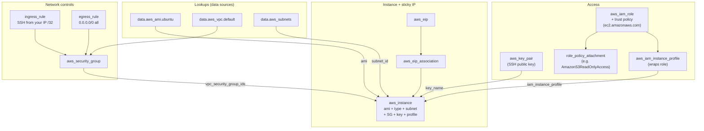

# 02 – EC2 (Elastic Compute Cloud)

The IaaS foundation of AWS: virtual servers (instances) you rent on AWS infrastructure with full OS control. AWS's first major service (2006). Many other AWS services run on EC2 under the hood (RDS, EKS data plane, classic ECS) — abstracted away from you, but the compute is there.

> [!info] Exam TL;DR
> - **An EC2 instance is composed of**: AMI (template), instance type (CPU/memory/network sizing), **subnet** (determines VPC + AZ), security group(s), key pair (SSH), EBS volumes (storage), optional user data (boot script), optional IAM instance profile (AWS API access), tags. The console wizard mirrors exactly this.
> - **AMI is region-scoped.** `ami-…` IDs are unique to one region — `aws ec2 copy-image` to move. Don't hardcode in Terraform; use `data "aws_ami"` to look up the latest matching for the current region.
> - **Stop ≠ Terminate.** Stop preserves EBS, instance ID, private IP, AMI ID, EIP; releases auto-assigned public IP and instance store. Terminate destroys the instance and any `delete_on_termination=true` volumes. **Root volume default `true`; additional EBS volumes default `false`** — asymmetric, exam-frequent.
> - **EBS = network-attached, persistent, AZ-scoped.** Instance Store = local NVMe, ephemeral. Both lose instance store data on stop or terminate.
> - **EC2 → other AWS APIs**: NEVER long-lived IAM user keys. Use IAM **role** wrapped in **instance profile** attached to the instance (see [[01-iam]]). EC2 takes an *instance profile*, not a role directly (unlike Lambda/ECS which take roles).
> - **IMDSv2 is default** on modern AMIs. Plain `curl http://169.254.169.254/...` returns empty — you must PUT to `/latest/api/token` first and pass the token in an `X-aws-ec2-metadata-token` header on subsequent GETs. SSRF defence.
> - **Public IPv4 is billed** since Feb 2024 (~$0.005/hour for both auto-assigned and EIPs, regardless of attachment state). The legacy "EIP free while attached" rule no longer holds.

## Concept (plain English)

You rent virtual servers in AWS data centres, sized per second (Linux on-demand). You pick an OS image (AMI), a hardware shape (instance type), drop it into a network (a subnet of a VPC), wrap it in firewall rules (security groups), and grant access via either an SSH key pair (you connect in) or an IAM instance profile (the instance reaches out to AWS APIs). The instance boots, runs your software, and bills you until you stop or terminate. State that persists across stop/start lives on **EBS** (network-attached, durable); ephemeral state lives on **instance store** (host-local SSDs that vanish when the instance moves to another host).

## AWS console ↔ Terraform map

| Console / what you want | Terraform | Notes |
|---|---|---|
| Look up the latest matching AMI for current region | `data "aws_ami"` | `owners` + `filter { name="name", values=[...] }`. **Need `most_recent = true`** or you'll error on multiple matches. Owner IDs: `amazon` (Amazon-published), `099720109477` (Canonical/Ubuntu), `self` (your own). |
| Look up the default VPC | `data "aws_vpc" { default = true }` | One-liner. |
| List subnets in a VPC | `data "aws_subnets"` (plural) | Returns `.ids` — a list/set of strings. **No `.id` attribute** — to get one, `tolist(data.aws_subnets.X.ids)[0]` or filter narrower (e.g. by AZ). |
| Look up a single subnet by ID | `data "aws_subnet"` (singular) | Useful chained after `aws_subnets` when you need AZ/CIDR etc. |
| Create a security group container | `aws_security_group` | Name, description, `vpc_id`. Does **not** define rules — those are separate resources. |
| Add an ingress (inbound) rule | `aws_vpc_security_group_ingress_rule` (modern, v6 preferred) | One resource per rule. `ip_protocol` is `"tcp"`/`"udp"`/`"icmp"`/`"-1"` (all). Ports are integers, not strings. |
| Add an egress (outbound) rule | `aws_vpc_security_group_egress_rule` | Same shape as ingress. |
| Register/upload an SSH public key | `aws_key_pair` | `public_key` takes a string. Use `file(pathexpand(var.path))` to load from disk. Ed25519 and RSA both supported. |
| Launch the instance | `aws_instance` | AMI, type, subnet, SG list, key pair, optional user data/IAM profile/root_block_device. |
| Allocate an Elastic IP | `aws_eip { domain = "vpc" }` | All EIPs are VPC EIPs now. |
| Associate EIP to instance | `aws_eip_association` | Or set `instance` on `aws_eip` directly (legacy inline style). |
| Attach an IAM role to the instance | `aws_iam_instance_profile` + `iam_instance_profile` on the instance | EC2 takes the **profile**, not the role directly. See [[01-iam]]. |

## Architecture diagram

## Key facts, limits & pricing

- **Regional service, but every instance lives in one AZ.** You pick a subnet → that determines VPC + AZ. Cannot stop/start to move AZ; only snapshot + relaunch in target AZ.
- **AMI region-scoped.** Unique `ami-…` per region. Copy with `aws ec2 copy-image` (snapshot storage + cross-region transfer charges).
- **AMI = metadata + reference to EBS snapshots** for modern EBS-backed AMIs. Snapshots hold the disk data; AMI bundles them with kernel/architecture/virtualization-type metadata to make them launchable.
- **Billing:**
  - **On-Demand Linux** — per-second after 60-second minimum. Windows + some Linux AMIs are per-hour.
  - **t2.micro / t3.micro** — Free Tier (750 hrs/month, 12 months from account creation); standard rate after.
  - **Public IPv4** — since **Feb 2024**, all IPv4 public addresses cost ~$0.005/hour. Old "EIP free while attached" rule no longer applies.
  - **EBS** — `gp3` ~$0.08/GB-month in `us-east-1`; ⚠️ verify current pricing.
- **`delete_on_termination` defaults differ by volume role:**
  - **Root volume** → `true` (deleted with instance).
  - **Additional EBS volume** → `false` (survives termination).
- **Instance type change** = **in-place** (`~`) in Terraform. Provider stops, modifies, restarts the instance. ~1–3 min downtime; instance ID, EBS, EIP preserved; auto-assigned public IP changes; instance store dies.
- **AMI change** = **destroy-and-recreate** (`-/+`). You can't swap the OS image on a running instance. ⚠️ verify against provider source for v6 — confirmed empirically in past plans.
- **Instance type naming:** `family.size` with a **literal period** (`t3.micro`, `t3.small`, `m5.large`). Families: `t` (burstable), `m` (general), `c` (compute), `r` (memory), `g`/`p` (GPU), `i` (storage). Generations: `t3`, `t3a` (AMD), `t4g` (Graviton/ARM). Hyphens (`t3-micro`) are rejected.
- **IMDS endpoint** is the link-local `169.254.169.254`, reachable only from inside the instance.

## Comparisons

### Stop vs Terminate

|   | Stop | Terminate |
|---|---|---|
| EBS root volume | Preserved | Deleted (default `delete_on_termination=true`) |
| Additional EBS volumes | Preserved | Preserved (default `delete_on_termination=false`) |
| Instance store data | **Lost** | **Lost** |
| Instance ID | Preserved | Released, can never be reused |
| Private IP | Preserved | Released |
| Auto-assigned public IP | **Released** | Released |
| Elastic IP (if associated) | Stays associated | Disassociated; EIP retained in your account |
| AMI ID metadata | Preserved | Preserved |
| Physical host | May change on start | N/A |
| Billing | Compute stops; EBS still bills | Stops entirely |

### EBS vs Instance Store

|   | EBS | Instance Store |
|---|---|---|
| Persistence | Yes — across stop/start (and terminate, if not `delete_on_termination`) | Ephemeral — lost on stop/terminate/host failure |
| Attachment | Network-attached, can detach/reattach | Physically on the host's local SSDs |
| Scope | AZ-scoped (cross-AZ move = snapshot + restore) | Host-scoped |
| Performance | Up to ~256K IOPS (`io2 Block Express`) | Very high local NVMe; usually faster than non-provisioned EBS |
| Cost | Per-GB-month + provisioned IOPS where applicable | Free with the instance |
| Multi-attach | `io1`/`io2` only, up to 16 instances, same AZ | Single-host by definition |
| Snapshots | Yes (point-in-time, to S3) | No — manually copy elsewhere |
| Use case | Anything you need to keep | Scratch, cache, big-data shuffle, swap |

### Auto-assigned Public IP vs Elastic IP

|   | Auto-assigned | Elastic IP |
|---|---|---|
| Source | AWS public IPv4 pool | Allocated to your account |
| Sticky across stop/start | **No** — released and reassigned | **Yes** |
| Default availability | Only if subnet has `map_public_ip_on_launch = true` (default VPC's public subnets do) | You allocate explicitly |
| Limit | None (one per public-subnet instance) | Soft 5 per region; raisable |
| Cost | ~$0.005/hour (since Feb 2024) | ~$0.005/hour, same |
| Move to another instance | No | Yes — disassociate + re-associate |
| Protocol | IPv4 only | IPv4 only (no IPv6 equivalent — addresses abundant) |

### IMDSv1 vs IMDSv2

|   | IMDSv1 | IMDSv2 |
|---|---|---|
| Request style | `GET http://169.254.169.254/…` directly | `PUT /latest/api/token` first → `GET` with `X-aws-ec2-metadata-token: <token>` header |
| Default on new AMIs | Was default until ~2023 | **Default required** on modern AMIs (Ubuntu 24.04 noble, recent AL2023, etc.) |
| Security model | Trusts anyone on the host | Session token; mitigates SSRF — an attacker who tricks your app into hitting `169.254.169.254` can't get the token because the PUT has to come from inside the SSRF-vulnerable process AND the response token has TTL+IP-tied semantics |
| If you forget the token | — | Endpoint returns empty / 401 silently |
| Get the token | — | `curl -s -X PUT "http://169.254.169.254/latest/api/token" -H "X-aws-ec2-metadata-token-ttl-seconds: 21600"` |

## The Terraform I wrote

Code: [`02-ec2/main.tf`](../02-ec2/main.tf) + [`variables.tf`](../02-ec2/variables.tf) + [`outputs.tf`](../02-ec2/outputs.tf)

10 managed resources end-to-end:

- **Lookups**: `data.aws_ami.ubuntu` (Canonical owner `099720109477`, filter on `ubuntu/images/hvm-ssd-gp3/ubuntu-noble-24.04-amd64-server-*`, `most_recent=true`); `data.aws_vpc.default { default = true }`; `data.aws_subnets.default_vpc` (filtered by `vpc-id`).
- **Network**: `aws_security_group.allow_ssh` (just the container, `vpc_id` from the data source). `aws_vpc_security_group_ingress_rule.allow_ssh_ipv4` (port 22 TCP from `var.admin_ssh_cidr` = my own IP `/32`). `aws_vpc_security_group_egress_rule.allow_all_traffic_ipv4` (open).
- **Access**: `aws_key_pair.admin` (ed25519, loaded via `file(pathexpand(var.ssh_public_key_path))`). `data.aws_iam_policy_document.ec2_assume_role` (trust policy: `Service = ec2.amazonaws.com`). `aws_iam_role.ec2_s3_read` (with `assume_role_policy = data...json`). `aws_iam_role_policy_attachment.ec2_s3_read` (attaches AWS-managed `arn:aws:iam::aws:policy/AmazonS3ReadOnlyAccess`). `aws_iam_instance_profile.ec2_s3_read` (wraps the role). IAM concepts: see [[01-iam]].
- **Instance**: `aws_instance.this` — `t3.micro`, `subnet_id = tolist(data.aws_subnets.default_vpc.ids)[0]`, references all of the above plus `iam_instance_profile = aws_iam_instance_profile.ec2_s3_read.name`.
- **EIP**: `aws_eip.this { domain = "vpc" }` + `aws_eip_association.this`.
- **Outputs**: `instance_public_ip`, `instance_public_dns`, `ssh_command` (built with `trimsuffix(var.ssh_public_key_path, ".pub")` to derive the private key path).

Non-obvious things hit while writing:

- **`aws_subnets.ids` is a list/set, not a single value.** First three attempts at referencing it crashed with "no attribute `.id`"; the fix was `tolist(...)[0]`.
- **`ip_protocol = "ssh"`** was rejected — value is the IP-layer protocol (`tcp`), not the application protocol. Port 22 is what makes it SSH.
- **`instance_type = "t3-micro"`** — hyphen instead of dot; AWS rejected with `InvalidParameterValue`.
- **`terraform console` showed `(known after apply)` after a successful plan** — plan reads data sources into memory, doesn't persist. Fix: `terraform apply -refresh-only` to commit the read to state.
- **Ubuntu 24.04 dropped `awscli` from `apt`** — `apt install awscli` returns "no installation candidate". Use AWS official installer (`curl awscliv2.zip` + `sudo ./aws/install`) or `snap install aws-cli --classic`. (Baking this into an AMI: see [[03-ami-bake]].)
- **IMDSv1-style `curl` returns empty** on Ubuntu 24.04. IMDSv2 enforced by default; need the PUT-token-first flow.
- **Adding `iam_instance_profile` is an in-place update** on a running instance (`~`); no replacement, SSH stays live.

## Flashcards

What are the main "ingredients" of an EC2 instance?
?
AMI (template), instance type (sizing), subnet (which determines VPC + AZ), security group(s) (stateful firewall), key pair (SSH access), EBS volumes (root + optional extras), optional user data (boot script), optional IAM instance profile (AWS API access), tags. The console launch wizard reflects exactly this list.

Is an AMI the same as an EBS snapshot?
?
No. For modern EBS-backed AMIs, the AMI is metadata + a reference to one or more EBS snapshots. The snapshots hold the disk data; the AMI wraps them with launchable metadata (kernel, architecture, virtualization-type). A snapshot on its own is not launchable; an AMI is.

What scope does an AMI live in?
?
Region. An `ami-…` ID is unique to one region. To use the same image in another region, `aws ec2 copy-image` — costs snapshot storage in the target region plus cross-region transfer. The #1 gotcha when hardcoding AMI IDs in multi-region Terraform.

When you stop an instance and start it again, what changes and what stays?
?
Stays: EBS root volume contents, instance ID, private IP, AMI ID, Elastic IP (if associated), additional EBS volumes. Changes: auto-assigned public IP (released, new one on start), instance store contents (gone — host may change). Always lost when stop OR terminate: instance store data.

`delete_on_termination` defaults — root vs additional volumes?
?
Root volume defaults to `true` (deleted with the instance). Additional EBS volumes default to `false` (survive termination, accrue storage charges, can be attached to another instance in the same AZ). Asymmetric — exam-frequent. Override per `root_block_device` / `ebs_block_device` block on `aws_instance`.

Why doesn't EC2 attach an IAM role directly?
?
EC2 attaches an instance profile — a thin container wrapping a role. The console silently creates an instance profile with the same name as the role; Terraform requires `aws_iam_instance_profile` explicitly, referenced from `aws_instance.iam_instance_profile`. Lambda, ECS tasks, etc. take a role directly — EC2 is the special case.

What's IMDSv2 and why does it matter?
?
Instance Metadata Service v2 — required on most modern AMIs. To query metadata you must first PUT `/latest/api/token` (gets a session token), then GET `/latest/meta-data/...` with the `X-aws-ec2-metadata-token: <token>` header. Purpose: defends against SSRF (most SSRF primitives only allow GET; tokens are TTL-limited). If you query without the token, IMDSv2 returns empty silently — easy to mistake for "no instance profile attached."

In Terraform, does changing `instance_type` on `aws_instance` force replace?
?
No — in-place update (`~`). The provider calls `StopInstance` → `ModifyInstanceAttribute` → `StartInstance`. ~1–3 min downtime; instance ID, EBS, EIP preserved; auto-assigned public IP changes; instance store dies. But `ami` IS ForceNew (`-/+`) — can't swap OS on a running instance. Always read the plan symbols, never assume.

How is `aws_subnets` (plural data source) different from `aws_subnet` (singular)?
?
`aws_subnets` returns a list/set of subnet IDs matching a filter, exposed as `.ids`. There is NO `.id` attribute. To pick one: `tolist(data.aws_subnets.X.ids)[0]`. `aws_subnet` returns full attributes for ONE subnet looked up by `id` or `filter`. Common pattern: use `aws_subnets` for the IDs in a VPC, then chain into `aws_subnet` per ID for details.

What's the difference between an auto-assigned public IP and an Elastic IP?
?
Auto-assigned: from AWS's public IPv4 pool, released on stop, new one on start (different IP). Elastic IP: allocated to your account, sticky across stop/start, movable between instances, soft limit 5/region. Both cost ~$0.005/hour since Feb 2024. For "I need a fixed IP" use EIP; for stateless instances behind an LB, auto-assigned is fine.

In `aws_vpc_security_group_ingress_rule`, what value does `ip_protocol` take?
?
`"tcp"`, `"udp"`, `"icmp"`, `"icmpv6"`, or `"-1"` (all). Does NOT take application-protocol names like `"ssh"` or `"http"` — those are just port-22-TCP and port-80-TCP. The AWS console *labels* the rule "SSH" once you set port 22 + TCP — friendly display, not API input.

How do you scope SSH access in a security group ingress rule safely?
?
Use your own public IP as the CIDR with a `/32` suffix (= "exactly this one IP"). Get it with `curl -s checkip.amazonaws.com`. Never `0.0.0.0/0` on port 22 — bots brute-force within minutes. Better real-world patterns: bastion host, AWS Systems Manager Session Manager (no SSH at all), or a VPN. Home IP rotates (ISP DHCP); use a variable so you can update it quickly.

## Scenario MCQs

> [!question]- 1. An EC2 instance with an attached EBS data volume (default `delete_on_termination=false`) is terminated. What happens to the data volume?
> **A.** Deleted along with the instance.
> **B.** Deleted only if the root volume's `delete_on_termination` is also false.
> **C.** Survives — sits in the account with storage charges, detachable to another instance in the same AZ.
> **D.** Moves automatically to S3 as a snapshot.
>
> **Answer: C.** Additional EBS volumes default `delete_on_termination=false`. The root volume defaults to `true` and goes with the instance. Asymmetric defaults are exam-frequent.

> [!question]- 2. You need to give an EC2 instance read-only access to S3. Which is the MOST secure approach?
> **A.** SSH in, run `aws configure`, paste an IAM user's access keys.
> **B.** Create an IAM role with `s3:Get*`/`s3:List*` + trust policy allowing `ec2.amazonaws.com`; wrap in an instance profile; attach to the instance.
> **C.** Add an SG ingress rule allowing the S3 service endpoint as source.
> **D.** Allow `0.0.0.0/0` egress on port 443 from the instance.
>
> **Answer: B.** Long-lived keys (A) are the anti-pattern. SGs are network firewall, not IAM (C). D is unrelated. The role + instance profile pattern gets the SDK temporary credentials via IMDSv2 — auto-rotating, no secrets on disk.

> [!question]- 3. You want to give your EC2 web server a fixed public IP so DNS records and external firewalls don't break when the instance restarts. Which is the BEST approach?
> **A.** Use an auto-assigned public IP and document the IP.
> **B.** Allocate an Elastic IP and associate it with the instance.
> **C.** Move the instance to a private subnet and add a NAT gateway.
> **D.** Place an ALB in front and use the ALB's DNS name.
>
> **Answer: B** is the direct answer. **D** is a superior real-world pattern for web traffic (ALB DNS is sticky, the backends can scale), but the question asks about giving *the EC2 instance itself* a fixed IP. A fails on stop/start. C is wrong (private subnets have no public IP at all). For SAA-C03, "fixed IP for a single instance" → EIP.

> [!question]- 4. You change `instance_type` from `t3.micro` to `t3.small` in `main.tf` and apply. What happens?
> **A.** Terraform destroys and recreates the instance.
> **B.** Terraform calls `StopInstance` → `ModifyInstanceAttribute` → `StartInstance`. Instance ID, EBS, EIP preserved; ~1–3 min downtime.
> **C.** Terraform fails — instance type is immutable.
> **D.** Terraform succeeds with no disruption.
>
> **Answer: B.** In-place update (`~`). Instance type is NOT `ForceNew` in the v6 provider — uses the AWS modify-instance API. But there IS user-visible disruption (stop+start). Auto-assigned public IP would change too (yours doesn't because EIP). Instance store data dies.

> [!question]- 5. You SSH into your fresh Ubuntu 24.04 EC2 instance, run `curl http://169.254.169.254/latest/meta-data/iam/info`, and it returns nothing. The instance profile IS attached. What's wrong?
> **A.** The instance has no internet access.
> **B.** IMDSv2 is required and you didn't get a session token first.
> **C.** IAM permissions denied the request.
> **D.** The role hasn't propagated yet.
>
> **Answer: B.** Modern AMIs default to IMDSv2 required. You need a PUT to `/latest/api/token` first, then GET with the `X-aws-ec2-metadata-token` header. With `curl -s`, IMDSv1-style requests fail silently. D is plausible (IAM propagation IS real) but the symptom — empty silent return — is the IMDSv2 signature.

## ⚠️ Traps & why the wrong answers are wrong   #trap

> [!warning] Trap — All EC2 attributes can be changed in-place
> No — `ami` forces replacement, `subnet_id` forces replacement (subnet determines AZ), most network-affecting attributes force replacement. Type, key name, security groups (mostly), and IAM profile are in-place. Always read the plan.

> [!warning] Trap — `ip_protocol` accepts `"ssh"` / `"http"`
> No — IP-layer protocols only: `tcp`/`udp`/`icmp`/`icmpv6`/`-1`. Application-layer names are friendly console labels, not API inputs.

> [!warning] Trap — `t3-micro` works
> No — AWS instance types are `family.size` with a literal dot. Hyphens get rejected at apply.

> [!warning] Trap — `aws_subnets.X.id` returns one subnet ID
> No — that data source returns a list under `.ids`. There is no singular `.id` on the plural resource.

> [!warning] Trap — IAM changes are instant
> Often near-instant, but eventually consistent — newly created roles can briefly fail to be assumed (propagation race). Retry-with-backoff is the answer. See [[01-iam]].

> [!warning] Trap — EBS volumes can be moved across AZs by detach + attach
> No — EBS is AZ-scoped. Cross-AZ requires snapshot → restore in target AZ.

> [!warning] Trap — Instance store survives stop
> No — instance store dies on stop AND terminate. EBS is what survives.

> [!warning] Trap — Long-lived access keys on an instance are fine for service-to-service
> Don't. Use an IAM role + instance profile. Long-lived keys in env files / user data are an audit and leak risk.

> [!warning] Trap — EIP is free while attached
> Was true pre-Feb 2024. Now every public IPv4 (auto-assigned and EIP) bills hourly regardless of attachment state.

## 🛠️ Recreate-from-memory drill

> [!example]- Recreate-from-memory drill
> Without looking at `02-ec2/main.tf`, build a fresh Terraform config in a new directory that:
> 1. Looks up the latest Ubuntu 24.04 noble amd64 AMI for the current region.
> 2. Uses the default VPC and one of its subnets.
> 3. Creates a security group + ingress rule allowing SSH from `<your IP>/32` only, plus open egress.
> 4. Registers an SSH public key from `~/.ssh/...pub`.
> 5. Launches a `t3.micro` instance using all of the above.
> 6. Allocates an EIP and associates it.
> 7. Outputs the public IP + a ready-to-paste SSH command.
>
> Use `data.aws_ami` for AMI lookup, `data.aws_vpc { default = true }` for the VPC, `tolist(data.aws_subnets.X.ids)[0]` for picking a subnet. Plan should show **7 resources to add**. Don't apply — the drill is to reach a clean plan from scratch.
>
> > [!success]- Reference solution
> > See `02-ec2/main.tf`. Identical resource set minus the IAM instance-profile section (which is optional Layer 2). Same patterns: `data` blocks at top, SG + rules, key pair, instance, EIP + association. Tag the resources with `Project = "saa-c03-learning"` via `default_tags` in `versions.tf`.

## 🔴 My weak spots (this topic)   #weak-spot

- [ ] **`aws_subnets.X.id` vs `.ids`** — got bitten three times before internalizing it. Plural data source = list. The `.id` (singular) attribute literally doesn't exist.
- [ ] **`t3.micro` vs `t3-micro`** — instance types are dot-separated. Hyphen looks plausible (e.g. AMI names use hyphens), but rejected at apply.
- [ ] **`ip_protocol` accepts only IP-layer names** (`tcp`/`udp`/`icmp`/`icmpv6`/`-1`), not application names like `"ssh"`. Console labels mislead.
- [ ] **IMDSv2 token flow** — IMDSv1-style raw curl returns empty silently on modern Ubuntu. PUT for token, then GET with `X-aws-ec2-metadata-token` header.
- [ ] **`terraform console` reads state, not plan-in-memory** — needs `apply` or `apply -refresh-only` for data source values to be queryable.
- [ ] **Ubuntu 24.04 dropped `awscli` from `apt`** — AWS official installer or snap.
- [ ] **Stop vs terminate granularity** — which attributes persist, which change, which die. Especially auto-assigned IP changes vs EIP staying; instance store always dies; root volume default `delete_on_termination=true` vs additional `false`.
- [ ] **Trust policy vs permissions policy on a Role** — `assume_role_policy` (on the role itself) says WHO can assume; permissions are attached separately and say WHAT they can do once assumed. Continued exam-frequent gap from [[01-iam]].
- [ ] **Naming decision paralysis** — got slowed down picking labels. §14 of CLAUDE.md now captures the rule: describe role not type, snake_case, "this"/"main" for singletons, rename freely before apply.

## 🔗 Docs

- [AWS EC2 User Guide](https://docs.aws.amazon.com/AWSEC2/latest/UserGuide/concepts.html) — entry point
- [Instance lifecycle (stop, terminate, hibernate)](https://docs.aws.amazon.com/AWSEC2/latest/UserGuide/ec2-instance-lifecycle.html)
- [AMIs](https://docs.aws.amazon.com/AWSEC2/latest/UserGuide/AMIs.html) — including region-scoping and copy-image
- [IMDSv2](https://docs.aws.amazon.com/AWSEC2/latest/UserGuide/configuring-instance-metadata-service.html) — security model + token flow
- [IAM roles for EC2](https://docs.aws.amazon.com/AWSEC2/latest/UserGuide/iam-roles-for-amazon-ec2.html) — instance profile pattern
- [EC2 pricing](https://aws.amazon.com/ec2/pricing/) — on-demand + IPv4 charge details
- [EBS volume types](https://docs.aws.amazon.com/AWSEC2/latest/UserGuide/ebs-volume-types.html) — gp3/gp2/io1/io2/st1/sc1
- [Terraform `aws_instance`](https://registry.terraform.io/providers/hashicorp/aws/latest/docs/resources/instance)
- [Terraform `aws_ami` data source](https://registry.terraform.io/providers/hashicorp/aws/latest/docs/data-sources/ami)
- [Terraform `aws_vpc_security_group_ingress_rule`](https://registry.terraform.io/providers/hashicorp/aws/latest/docs/resources/vpc_security_group_ingress_rule)
- [Terraform `aws_iam_instance_profile`](https://registry.terraform.io/providers/hashicorp/aws/latest/docs/resources/iam_instance_profile)
- Verified against v6 provider source (2026-05): `aws_iam_user.name` is NOT `ForceNew`; `aws_iam_policy.name` IS `ForceNew`; `aws_iam_group_policy_attachments_exclusive` exists.
